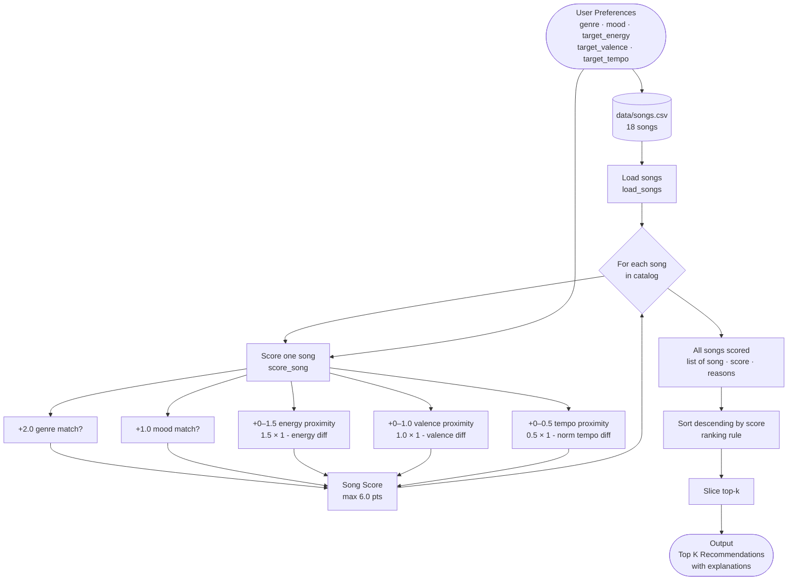

# 🎵 Music Recommender Simulation

## Project Summary

In this project you will build and explain a small music recommender system.

Your goal is to:

- Represent songs and a user "taste profile" as data
- Design a scoring rule that turns that data into recommendations
- Evaluate what your system gets right and wrong
- Reflect on how this mirrors real world AI recommenders

Replace this paragraph with your own summary of what your version does.

---

## How The System Works

### Song Features

Each `Song` in the catalog is described by seven attributes:

- **genre** — broad style category (pop, lofi, rock, jazz, ambient, synthwave, indie pop)
- **mood** — emotional label (happy, chill, intense, moody, focused, relaxed)
- **energy** — a 0–1 float for perceived intensity; 0.28 is quiet ambient, 0.93 is a hard workout track
- **tempo_bpm** — speed in beats per minute, ranging from 60 to 152 in this catalog
- **valence** — a 0–1 float for musical positivity; high = cheerful, low = dark or melancholic
- **danceability** — a 0–1 float for how rhythmically suitable the track is for dancing
- **acousticness** — a 0–1 float for how acoustic (vs. electronic) the track sounds

### User Profile

A `UserProfile` stores the listener's taste preferences:

- **favorite_genre** — the genre they most want to hear
- **favorite_mood** — the mood they are looking for right now
- **target_energy** — the energy level they want (e.g., 0.8 for a workout, 0.4 for studying)
- **likes_acoustic** — a boolean for whether they prefer acoustic over electronic sounds

### Algorithm Recipe (Finalized)

Each song is scored against the user profile using a point-based system with a **maximum of 6.0 points**:

| Rule | Max Points | Method |
|---|---|---|
| Genre match | +2.0 | Exact string match — all or nothing |
| Mood match | +1.0 | Exact string match — all or nothing |
| Energy proximity | +0–1.5 | `1.5 × (1 - \|song.energy − target_energy\|)` |
| Valence proximity | +0–1.0 | `1.0 × (1 - \|song.valence − target_valence\|)` |
| Tempo proximity | +0–0.5 | `0.5 × (1 - \|normalized tempo diff\|)` over range 60–180 BPM |

**Why these weights:**
- Genre (2.0) is the dominant rule because a genre mismatch is a near-dealbreaker regardless of any other feature. A jazz fan and a metal fan share almost no overlap.
- Energy (1.5) is the highest-weighted continuous feature because it defines the functional context of the session — working out vs. sleeping vs. studying.
- Mood (1.0) matters but is softer than genre; adjacent moods like "chill" and "relaxed" often feel interchangeable to a listener.
- Valence (1.0) captures the emotional brightness of the track — an often-overlooked but critical axis separating cheerful pop from brooding synthwave.
- Tempo (0.5) is a fine-tuning detail. Within a genre, tempo variance is already partially captured by energy, so it carries the least weight.

**Proximity formula explained:**
For any 0–1 float feature, a perfect match scores the full points and the score degrades linearly as the values diverge. The worst possible case (e.g., user wants energy 0.0 and song has energy 1.0) yields 0 points, never negative — the score is always bounded between 0 and 6.

### How Songs Are Ranked and Returned

Once every song in the catalog has been scored, the `Recommender` sorts all songs by score descending and returns the top-k. The scoring rule evaluates one song at a time; the ranking rule only sees the finished scores. Keeping these two steps separate makes each independently testable and lets the ranking strategy be swapped (e.g., add diversity re-ranking) without touching the score math.

### Expected Biases and Limitations

- **Genre over-dominance:** At 2.0 points, a genre match alone outweighs a perfect energy+tempo score (max 2.0 combined). A genuinely great mood-and-energy match in the wrong genre will always rank below a mediocre same-genre song. A listener open to genre-crossing recommendations will be underserved.
- **Mood adjacency is ignored:** "Chill" and "relaxed" feel nearly identical but score 0 for each other. The binary match rule has no concept of closeness for categorical features.
- **No catalog diversity:** The scoring is purely greedy — top-k always picks the highest scorers, which may mean the same artist or sub-style appears multiple times in a 5-song recommendation.
- **Cold-start for new features:** If the user profile omits `target_valence` or `target_tempo`, those sub-scores are skipped entirely, silently reducing the max achievable score and making songs indistinguishable on those axes.
- **Small catalog:** With only 18 songs, some genres appear once. A metal fan will always get `Bone Cold` as their top hit regardless of how well the energy or valence actually matches, simply because it is the only option.

### Data Flow Diagram



**Reading the diagram:**
- The left side feeds two inputs into the loop: the user's preference dict and the full song catalog.
- Every song passes through `score_song` independently — five sub-scores are added up to produce one float.
- After all 18 songs are scored the ranking rule sorts the list and slices the top-k. The scoring and ranking steps are intentionally separate boxes.

---

## Sample Terminal Output

Run command: `python src/main.py` (from project root) using the **Pop / Happy** profile.

```
Loaded songs: 18

========================================================================
  MUSIC RECOMMENDER — POP / HAPPY
  Genre: pop  |  Mood: happy  |  Energy: 0.82  |  Valence: 0.84  |  Tempo: 120 BPM
========================================================================

  #1  Sunrise City  —  Neon Echo
       Score: 5.99 / 6.00  [###################-]
         • genre match 'pop' (+2.0)
         • mood match 'happy' (+1.0)
         • energy 0.82 vs target 0.82 (+1.5/1.50)
         • valence 0.84 vs target 0.84 (+1.0/1.00)
         • tempo 118.0 BPM vs target 120 BPM (+0.49/0.50)

  #2  Gym Hero  —  Max Pulse
       Score: 4.71 / 6.00  [###############-----]
         • genre match 'pop' (+2.0)
         • mood mismatch: 'intense' vs 'happy' (+0.0)
         • energy 0.93 vs target 0.82 (+1.33/1.50)
         • valence 0.77 vs target 0.84 (+0.93/1.00)
         • tempo 132.0 BPM vs target 120 BPM (+0.45/0.50)

  #3  Rooftop Lights  —  Indigo Parade
       Score: 3.86 / 6.00  [############--------]
         • genre mismatch: 'indie pop' vs 'pop' (+0.0)
         • mood match 'happy' (+1.0)
         • energy 0.76 vs target 0.82 (+1.41/1.50)
         • valence 0.81 vs target 0.84 (+0.97/1.00)
         • tempo 124.0 BPM vs target 120 BPM (+0.48/0.50)

  #4  Drop The City  —  Bass Frontier
       Score: 2.72 / 6.00  [#########-----------]
         • genre mismatch: 'hip-hop' vs 'pop' (+0.0)
         • mood mismatch: 'energetic' vs 'happy' (+0.0)
         • energy 0.87 vs target 0.82 (+1.42/1.50)
         • valence 0.72 vs target 0.84 (+0.88/1.00)
         • tempo 102.0 BPM vs target 120 BPM (+0.42/0.50)

  #5  Neon Carnival  —  Club Static
       Score: 2.65 / 6.00  [########------------]
         • genre mismatch: 'edm' vs 'pop' (+0.0)
         • mood mismatch: 'euphoric' vs 'happy' (+0.0)
         • energy 0.96 vs target 0.82 (+1.29/1.50)
         • valence 0.9 vs target 0.84 (+0.94/1.00)
         • tempo 140.0 BPM vs target 120 BPM (+0.42/0.50)

========================================================================
```

**Verification notes:**
- `#1 Sunrise City` scores 5.99/6.00 — genre + mood match plus near-perfect numerical proximity on all three axes. The only lost point is 0.01 on tempo (118 vs 120 BPM).
- `#2 Gym Hero` drops to 4.71 — same genre (pop) but mood mismatch (`intense` vs `happy`) costs the full 1.0 point.
- `#3 Rooftop Lights` (indie pop) reaches #3 despite no genre match, purely because mood matches and all numerical features are close. This is a known limitation — `indie pop` and `pop` feel similar to a human listener but score as completely different to the system.
- `#4` and `#5` (hip-hop, edm) have zero categorical matches but rank above heavier genres like metal and classical because their energy and valence sit close to the pop/happy profile.

---

### High-Energy Rock

Run command: `python -m src.main` using the **High-Energy Rock** profile.

```
========================================================================
  MUSIC RECOMMENDER — HIGH-ENERGY ROCK
  Genre: rock  |  Mood: intense  |  Energy: 0.9  |  Valence: 0.45  |  Tempo: 150 BPM
========================================================================

  #1  Storm Runner  —  Voltline
       Score: 5.94 / 6.00  [###################-]
         • genre match 'rock' (+2.0)
         • mood match 'intense' (+1.0)
         • energy 0.91 vs target 0.9 (+1.48/1.50)
         • valence 0.48 vs target 0.45 (+0.97/1.00)
         • tempo 152.0 BPM vs target 150 BPM (+0.49/0.50)

  #2  Gym Hero  —  Max Pulse
       Score: 3.56 / 6.00  [###########---------]
         • genre mismatch: 'pop' vs 'rock' (+0.0)
         • mood match 'intense' (+1.0)
         • energy 0.93 vs target 0.9 (+1.46/1.50)
         • valence 0.77 vs target 0.45 (+0.68/1.00)
         • tempo 132.0 BPM vs target 150 BPM (+0.42/0.50)

  #3  Night Drive Loop  —  Neon Echo
       Score: 2.56 / 6.00  [########------------]
         • genre mismatch: 'synthwave' vs 'rock' (+0.0)
         • mood mismatch: 'moody' vs 'intense' (+0.0)
         • energy 0.75 vs target 0.9 (+1.27/1.50)
         • valence 0.49 vs target 0.45 (+0.96/1.00)
         • tempo 110.0 BPM vs target 150 BPM (+0.33/0.50)

  #4  Bone Cold  —  Dread Signal
       Score: 2.55 / 6.00  [########------------]
         • genre mismatch: 'metal' vs 'rock' (+0.0)
         • mood mismatch: 'angry' vs 'intense' (+0.0)
         • energy 0.97 vs target 0.9 (+1.4/1.50)
         • valence 0.18 vs target 0.45 (+0.73/1.00)
         • tempo 168.0 BPM vs target 150 BPM (+0.42/0.50)

  #5  Drop The City  —  Bass Frontier
       Score: 2.49 / 6.00  [########------------]
         • genre mismatch: 'hip-hop' vs 'rock' (+0.0)
         • mood mismatch: 'energetic' vs 'intense' (+0.0)
         • energy 0.87 vs target 0.9 (+1.46/1.50)
         • valence 0.72 vs target 0.45 (+0.73/1.00)
         • tempo 102.0 BPM vs target 150 BPM (+0.3/0.50)

========================================================================
```

**Verification notes:**
- `#1 Storm Runner` scores 5.94/6.00 — the only rock/intense song in the catalog, near-perfect match on all axes.
- `#2 Gym Hero` (pop) reaches #2 on mood match alone — no genre points, but `intense` mood + high energy keep it competitive.
- `#3–#5` all have zero categorical matches; they rank purely on energy and valence proximity to the rock profile.

---

### Chill Lofi

Run command: `python -m src.main` using the **Chill Lofi** profile.

```
========================================================================
  MUSIC RECOMMENDER — CHILL LOFI
  Genre: lofi  |  Mood: chill  |  Energy: 0.38  |  Valence: 0.58  |  Tempo: 75 BPM
========================================================================

  #1  Library Rain  —  Paper Lanterns
       Score: 5.93 / 6.00  [###################-]
         • genre match 'lofi' (+2.0)
         • mood match 'chill' (+1.0)
         • energy 0.35 vs target 0.38 (+1.46/1.50)
         • valence 0.6 vs target 0.58 (+0.98/1.00)
         • tempo 72.0 BPM vs target 75 BPM (+0.49/0.50)

  #2  Midnight Coding  —  LoRoom
       Score: 5.91 / 6.00  [###################-]
         • genre match 'lofi' (+2.0)
         • mood match 'chill' (+1.0)
         • energy 0.42 vs target 0.38 (+1.44/1.50)
         • valence 0.56 vs target 0.58 (+0.98/1.00)
         • tempo 78.0 BPM vs target 75 BPM (+0.49/0.50)

  #3  Focus Flow  —  LoRoom
       Score: 4.94 / 6.00  [################----]
         • genre match 'lofi' (+2.0)
         • mood mismatch: 'focused' vs 'chill' (+0.0)
         • energy 0.4 vs target 0.38 (+1.47/1.50)
         • valence 0.59 vs target 0.58 (+0.99/1.00)
         • tempo 80.0 BPM vs target 75 BPM (+0.48/0.50)

  #4  Spacewalk Thoughts  —  Orbit Bloom
       Score: 3.72 / 6.00  [############--------]
         • genre mismatch: 'ambient' vs 'lofi' (+0.0)
         • mood match 'chill' (+1.0)
         • energy 0.28 vs target 0.38 (+1.35/1.50)
         • valence 0.65 vs target 0.58 (+0.93/1.00)
         • tempo 60.0 BPM vs target 75 BPM (+0.44/0.50)

  #5  Rust & Rain  —  The Hollow Pines
       Score: 2.83 / 6.00  [#########-----------]
         • genre mismatch: 'country' vs 'lofi' (+0.0)
         • mood mismatch: 'nostalgic' vs 'chill' (+0.0)
         • energy 0.44 vs target 0.38 (+1.41/1.50)
         • valence 0.62 vs target 0.58 (+0.96/1.00)
         • tempo 84.0 BPM vs target 75 BPM (+0.46/0.50)

========================================================================
```

**Verification notes:**
- `#1` and `#2` are both lofi/chill and score nearly identically (5.93 vs 5.91) — the catalog has two strong matches.
- `#3 Focus Flow` keeps its genre points but loses the full mood point (`focused` vs `chill`), dropping to 4.94.
- `#5 Rust & Rain` (country) sneaks into the top 5 purely on numerical proximity — low energy and mid valence happen to fit the lofi profile even across a genre mismatch.

---

### Adversarial — High-Energy + Sad

Run command: `python -m src.main` using the **Adversarial — High-Energy + Sad** profile.
Conflict: `energy: 0.95` + `mood: sad` + `valence: 0.15` — tests whether the scoring is "tricked" by contradictory preferences.

```
========================================================================
  MUSIC RECOMMENDER — ADVERSARIAL — HIGH-ENERGY + SAD
  Genre: pop  |  Mood: sad  |  Energy: 0.95  |  Valence: 0.15  |  Tempo: 160 BPM
========================================================================

  #1  Gym Hero  —  Max Pulse
       Score: 4.23 / 6.00  [##############------]
         • genre match 'pop' (+2.0)
         • mood mismatch: 'intense' vs 'sad' (+0.0)
         • energy 0.93 vs target 0.95 (+1.47/1.50)
         • valence 0.77 vs target 0.15 (+0.38/1.00)
         • tempo 132.0 BPM vs target 160 BPM (+0.38/0.50)

  #2  Sunrise City  —  Neon Echo
       Score: 3.93 / 6.00  [#############-------]
         • genre match 'pop' (+2.0)
         • mood mismatch: 'happy' vs 'sad' (+0.0)
         • energy 0.82 vs target 0.95 (+1.3/1.50)
         • valence 0.84 vs target 0.15 (+0.31/1.00)
         • tempo 118.0 BPM vs target 160 BPM (+0.32/0.50)

  #3  Bone Cold  —  Dread Signal
       Score: 2.91 / 6.00  [#########-----------]
         • genre mismatch: 'metal' vs 'pop' (+0.0)
         • mood mismatch: 'angry' vs 'sad' (+0.0)
         • energy 0.97 vs target 0.95 (+1.47/1.50)
         • valence 0.18 vs target 0.15 (+0.97/1.00)
         • tempo 168.0 BPM vs target 160 BPM (+0.47/0.50)

  #4  Sunday Sermon  —  Velvet South
       Score: 2.60 / 6.00  [########------------]
         • genre mismatch: 'soul' vs 'pop' (+0.0)
         • mood match 'sad' (+1.0)
         • energy 0.39 vs target 0.95 (+0.66/1.50)
         • valence 0.34 vs target 0.15 (+0.81/1.00)
         • tempo 72.0 BPM vs target 160 BPM (+0.13/0.50)

  #5  Storm Runner  —  Voltline
       Score: 2.58 / 6.00  [########------------]
         • genre mismatch: 'rock' vs 'pop' (+0.0)
         • mood mismatch: 'intense' vs 'sad' (+0.0)
         • energy 0.91 vs target 0.95 (+1.44/1.50)
         • valence 0.48 vs target 0.15 (+0.67/1.00)
         • tempo 152.0 BPM vs target 160 BPM (+0.47/0.50)

========================================================================
```

**Verification notes:**
- The recommender is not "tricked" — it degrades gracefully. Genre weight (2.0) still dominates, so pop songs rank highest even though none are actually sad.
- `#3 Bone Cold` (metal) is the only song whose valence (0.18) closely matches the target (0.15), but no genre or mood points hold it back from #1.
- `#4 Sunday Sermon` is the only song with a `sad` mood match, yet ranks #4 because genre mismatch + low energy proximity outweigh the mood point.

---

### Adversarial — No Genre Match (Country)

Run command: `python -m src.main` using the **Adversarial — No Genre Match (Country)** profile.
Edge case: tests whether the ranker degrades gracefully when almost no songs match the requested genre.

```
========================================================================
  MUSIC RECOMMENDER — ADVERSARIAL — NO GENRE MATCH (COUNTRY)
  Genre: country  |  Mood: happy  |  Energy: 0.6  |  Valence: 0.7  |  Tempo: 100 BPM
========================================================================

  #1  Rust & Rain  —  The Hollow Pines
       Score: 4.61 / 6.00  [###############-----]
         • genre match 'country' (+2.0)
         • mood mismatch: 'nostalgic' vs 'happy' (+0.0)
         • energy 0.44 vs target 0.6 (+1.26/1.50)
         • valence 0.62 vs target 0.7 (+0.92/1.00)
         • tempo 84.0 BPM vs target 100 BPM (+0.43/0.50)

  #2  Rooftop Lights  —  Indigo Parade
       Score: 3.55 / 6.00  [###########---------]
         • genre mismatch: 'indie pop' vs 'country' (+0.0)
         • mood match 'happy' (+1.0)
         • energy 0.76 vs target 0.6 (+1.26/1.50)
         • valence 0.81 vs target 0.7 (+0.89/1.00)
         • tempo 124.0 BPM vs target 100 BPM (+0.4/0.50)

  #3  Sunrise City  —  Neon Echo
       Score: 3.45 / 6.00  [###########---------]
         • genre mismatch: 'pop' vs 'country' (+0.0)
         • mood match 'happy' (+1.0)
         • energy 0.82 vs target 0.6 (+1.17/1.50)
         • valence 0.84 vs target 0.7 (+0.86/1.00)
         • tempo 118.0 BPM vs target 100 BPM (+0.42/0.50)

  #4  Golden Hour Drive  —  Solis
       Score: 2.77 / 6.00  [#########-----------]
         • genre mismatch: 'r&b' vs 'country' (+0.0)
         • mood mismatch: 'romantic' vs 'happy' (+0.0)
         • energy 0.58 vs target 0.6 (+1.47/1.50)
         • valence 0.88 vs target 0.7 (+0.82/1.00)
         • tempo 96.0 BPM vs target 100 BPM (+0.48/0.50)

  #5  Coffee Shop Stories  —  Slow Stereo
       Score: 2.61 / 6.00  [########------------]
         • genre mismatch: 'jazz' vs 'country' (+0.0)
         • mood mismatch: 'relaxed' vs 'happy' (+0.0)
         • energy 0.37 vs target 0.6 (+1.16/1.50)
         • valence 0.71 vs target 0.7 (+0.99/1.00)
         • tempo 90.0 BPM vs target 100 BPM (+0.46/0.50)

========================================================================
```

**Verification notes:**
- There is exactly one country song (`Rust & Rain`) in the catalog — it ranks #1 with 4.61/6.00 despite a mood mismatch, because the 2.0 genre bonus is large enough.
- `#2–#5` have zero genre points. The system falls back entirely to mood + numerical proximity, which is the correct graceful degradation behavior.
- `#4 Golden Hour Drive` (r&b) and `#5 Coffee Shop Stories` (jazz) rank on energy and valence alone — no categorical matches at all.

---

## Getting Started

### Setup

1. Create a virtual environment (optional but recommended):

   ```bash
   python -m venv .venv
   source .venv/bin/activate      # Mac or Linux
   .venv\Scripts\activate         # Windows

2. Install dependencies

```bash
pip install -r requirements.txt
```

3. Run the app:

```bash
python -m src.main
```

### Running Tests

Run the starter tests with:

```bash
pytest
```

You can add more tests in `tests/test_recommender.py`.

---

## Experiments You Tried

Use this section to document the experiments you ran. For example:

- What happened when you changed the weight on genre from 2.0 to 0.5
- What happened when you added tempo or valence to the score
- How did your system behave for different types of users

---

## Limitations and Risks

Summarize some limitations of your recommender.

Examples:

- It only works on a tiny catalog
- It does not understand lyrics or language
- It might over favor one genre or mood

You will go deeper on this in your model card.

---

## Reflection

Read and complete `model_card.md`:

[**Model Card**](model_card.md)

Write 1 to 2 paragraphs here about what you learned:

- about how recommenders turn data into predictions
- about where bias or unfairness could show up in systems like this


---

## 7. `model_card_template.md`

Combines reflection and model card framing from the Module 3 guidance. :contentReference[oaicite:2]{index=2}  

```markdown
# 🎧 Model Card - Music Recommender Simulation

## 1. Model Name

Give your recommender a name, for example:

> VibeFinder 1.0

---

## 2. Intended Use

- What is this system trying to do
- Who is it for

Example:

> This model suggests 3 to 5 songs from a small catalog based on a user's preferred genre, mood, and energy level. It is for classroom exploration only, not for real users.

---

## 3. How It Works (Short Explanation)

Describe your scoring logic in plain language.

- What features of each song does it consider
- What information about the user does it use
- How does it turn those into a number

Try to avoid code in this section, treat it like an explanation to a non programmer.

---

## 4. Data

Describe your dataset.

- How many songs are in `data/songs.csv`
- Did you add or remove any songs
- What kinds of genres or moods are represented
- Whose taste does this data mostly reflect

---

## 5. Strengths

Where does your recommender work well

You can think about:
- Situations where the top results "felt right"
- Particular user profiles it served well
- Simplicity or transparency benefits

---

## 6. Limitations and Bias

Where does your recommender struggle

Some prompts:
- Does it ignore some genres or moods
- Does it treat all users as if they have the same taste shape
- Is it biased toward high energy or one genre by default
- How could this be unfair if used in a real product

---

## 7. Evaluation

How did you check your system

Examples:
- You tried multiple user profiles and wrote down whether the results matched your expectations
- You compared your simulation to what a real app like Spotify or YouTube tends to recommend
- You wrote tests for your scoring logic

You do not need a numeric metric, but if you used one, explain what it measures.

---

## 8. Future Work

If you had more time, how would you improve this recommender

Examples:

- Add support for multiple users and "group vibe" recommendations
- Balance diversity of songs instead of always picking the closest match
- Use more features, like tempo ranges or lyric themes

---

## 9. Personal Reflection

A few sentences about what you learned:

- What surprised you about how your system behaved
- How did building this change how you think about real music recommenders
- Where do you think human judgment still matters, even if the model seems "smart"

